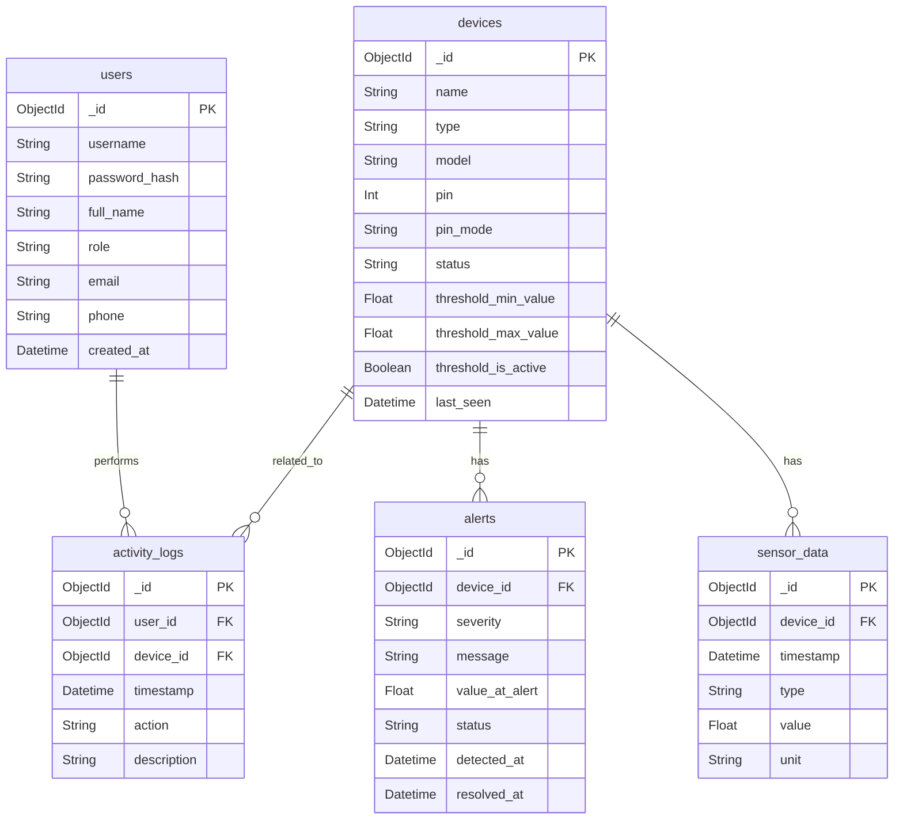

# Thiết kế Cơ sở dữ liệu MongoDB - Hệ thống Ngôi nhà Thông minh

## 1. Danh sách các Collections

### 1.1. Collection `users`
Lưu trữ thông tin các thành viên trong gia đình (Home Owner và Household Member).

*   **_id**: `ObjectId`
*   **username**: `String` (Unique, Index)
*   **password_hash**: `String`
*   **full_name**: `String`
*   **role**: `String` (Enum: 'admin', 'member')
*   **email**: `String`
*   **phone**: `String`
*   **created_at**: `Date`

### 1.2. Collection `devices`
Quản lý thông tin phần cứng, bao gồm cả cảm biến (Sensor) và thiết bị chấp hành (Actuator).

*   **_id**: `ObjectId`
*   **name**: `String`
*   **type**: `String` (Enum: 'sensor', 'actuator')
*   **model**: `String`
*   **pin**: `Int`
*   **pin_mode**: `String`
*   **status**: `String`
*   **threshold_min_value**: `Float`
*   **threshold_max_value**: `Float`
*   **threshold_is_active**: `Boolean`
*   **last_seen**: `Date`

### 1.3. Collection `sensor_data`
Lưu trữ nhật ký dữ liệu môi trường.

*   **_id**: `ObjectId`
*   **device_id**: `ObjectId` (Ref: `devices`)
*   **timestamp**: `Date`
*   **type**: `String`
*   **value**: `Float`
*   **unit**: `String`

### 1.4. Collection `alerts`
Lưu trữ các sự kiện cảnh báo.

*   **_id**: `ObjectId`
*   **device_id**: `ObjectId` (Ref: `devices`)
*   **severity**: `String`
*   **message**: `String`
*   **value_at_alert**: `Float`
*   **status**: `String`
*   **detected_at**: `Date`
*   **resolved_at**: `Date`

### 1.5. Collection `activity_logs`
Lưu trữ lịch sử tương tác.

*   **_id**: `ObjectId`
*   **user_id**: `ObjectId` (Ref: `users`)
*   **device_id**: `ObjectId` (Ref: `devices`)
*   **timestamp**: `Date`
*   **action**: `String`
*   **description**: `String`

## 2. Sơ đồ ERD (Mermaid)

## 3. Giải thích quyết định thiết kế

### 3.1. Cấu trúc Schema
*   **Users**: Chứa thông tin định danh và liên lạc (email, phone) để phục vụ thông báo.
*   **Devices**: Lưu trạng thái và cấu hình ngưỡng ngay trên document thiết bị để truy xuất nhanh.
*   **Sensor Data**: Tách riêng để tối ưu cho dữ liệu chuỗi thời gian (time-series) khối lượng lớn.
*   **Alerts**: Tách riêng để dễ dàng quản lý vòng đời cảnh báo (active -> resolved).
*   **Activity Logs**: Ghi lại mọi tác động của người dùng lên thiết bị bảo đảm tính audit.
