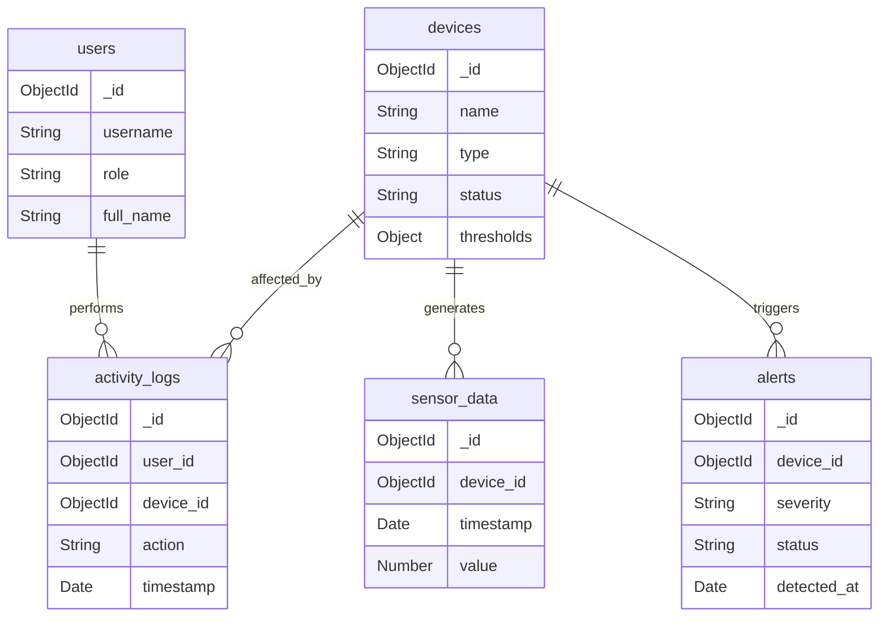

# Thiết kế Cơ sở dữ liệu MongoDB - Hệ thống Ngôi nhà Thông minh

## 1. Danh sách các Collections

### 1.1. Collection `users`
Lưu trữ thông tin các thành viên trong gia đình (Home Owner và Household Member).

*   **_id**: `ObjectId`
*   **username**: `String` (Unique, Index)
*   **password_hash**: `String`
*   **full_name**: `String`
*   **role**: `String` (Enum: 'admin', 'member')
*   **contact_info**: `Object` (Embedded)
    *   **email**: `String`
    *   **phone**: `String`
*   **created_at**: `Date`

### 1.2. Collection `devices`
Quản lý thông tin phần cứng, bao gồm cả cảm biến (Sensor) và thiết bị chấp hành (Actuator).
**Chiến lược thiết kế:** *Embedding Configuration*. Cấu hình ngưỡng cảnh báo được nhúng trực tiếp vào document thiết bị.

*   **_id**: `ObjectId`
*   **name**: `String` (Ví dụ: "Cảm biến phòng khách")
*   **type**: `String` (Enum: 'sensor', 'actuator')
*   **model**: `String` (Enum: 'DHT20', 'LightSensor', 'Relay', 'Servo'...)
*   **pin_config**: `Object` (Embedded - Thông tin kết nối vật lý)
    *   **pin**: `Number`
    *   **mode**: `String` (Analog/Digital/I2C)
*   **status**: `String` (Enum: 'online', 'offline', 'maintenance')
*   **thresholds**: `Object` (Embedded - Chỉ dành cho Sensor)
    *   **min_value**: `Number`
    *   **max_value**: `Number`
    *   **is_active**: `Boolean`
*   **last_seen**: `Date`

### 1.3. Collection `sensor_data` (Time-Series)
Lưu trữ nhật ký dữ liệu môi trường.
**Chiến lược thiết kế:** *Referencing*. Dữ liệu có tần suất ghi cao (High Velocity) và dung lượng lớn, không thể nhúng vào Devices.

*   **_id**: `ObjectId`
*   **device_id**: `ObjectId` (Ref: `devices`)
*   **timestamp**: `Date` (Index)
*   **type**: `String` (Enum: 'temperature', 'humidity', 'light', 'smoke')
*   **value**: `Number`
*   **unit**: `String` (Ví dụ: 'C', '%', 'lux')

### 1.4. Collection `alerts`
Lưu trữ các sự kiện cảnh báo khi thông số môi trường vượt ngưỡng an toàn.

*   **_id**: `ObjectId`
*   **device_id**: `ObjectId` (Ref: `devices`)
*   **severity**: `String` (Enum: 'info', 'warning', 'critical')
*   **message**: `String` (Ví dụ: "Nhiệt độ phòng khách quá cao: 40°C")
*   **value_at_alert**: `Number`
*   **status**: `String` (Enum: 'active', 'acknowledged', 'resolved')
*   **detected_at**: `Date`
*   **resolved_at**: `Date`

### 1.5. Collection `activity_logs`
Lưu trữ lịch sử tương tác của người dùng và hệ thống.

*   **_id**: `ObjectId`
*   **user_id**: `ObjectId` (Ref: `users`, Nullable nếu là System auto-action)
*   **device_id**: `ObjectId` (Ref: `devices`)
*   **timestamp**: `Date`
*   **action**: `String` (Enum: 'TURN_ON', 'TURN_OFF', 'UPDATE_CONFIG')
*   **description**: `String`

## 2. Sơ đồ ERD (Mermaid)

## 3. Giải thích quyết định thiết kế

### 3.1. Embedding: Device Thresholds
*   **Quyết định:** Nhúng (Embed) thông tin cấu hình ngưỡng (`thresholds`) vào trong document `devices` thay vì tạo collection riêng.
*   **Lý do:**
    *   **Truy vấn nguyên tử (Atomic):** Khi hệ thống đọc thông tin thiết bị để xử lý dữ liệu đầu vào, nó cần ngay lập tức biết các ngưỡng giới hạn để so sánh. Việc nhúng giúp lấy tất cả dữ liệu cần thiết trong 1 lần đọc (`findOne`).
    *   **Ít thay đổi:** Cấu hình ngưỡng hiếm khi thay đổi so với tần suất đọc dữ liệu, nên không lo ngại về chi phí cập nhật document.

### 3.2. Referencing: Sensor Data & Alerts
*   **Quyết định:** Tách `sensor_data` và `alerts` thành collection riêng và dùng Reference (`device_id`) trỏ về `devices`.
*   **Lý do:**
    *   **Kích thước dữ liệu (Unbounded Growth):** Dữ liệu cảm biến được ghi liên tục theo thời gian (ví dụ 5 giây/lần). Nếu nhúng vào `device`, mảng dữ liệu sẽ nhanh chóng làm đầy giới hạn 16MB/document của MongoDB.
    *   **Hiệu suất truy vấn:** Các truy vấn thường là "Lấy dữ liệu nhiệt độ trong 1 giờ qua" hoặc "Lấy tất cả cảnh báo chưa xử lý". Việc tách riêng collection cho phép đánh index hiệu quả trên trường `timestamp` và `status` độc lập với thông tin thiết bị.

db in dbdiagram

/////////////////////////////////////////////////////////
Table users {
  _id objectid [pk]
  username varchar [unique]
  password_hash varchar
  full_name varchar
  role varchar
  email varchar
  phone varchar
  created_at datetime
}

Table devices {
  _id objectid [pk]
  name varchar
  type varchar
  model varchar
  pin int
  pin_mode varchar
  status varchar
  threshold_min_value float
  threshold_max_value float
  threshold_is_active boolean
  last_seen datetime
}

Table sensor_data {
  _id objectid [pk]
  device_id objectid
  timestamp datetime
  type varchar
  value float
  unit varchar
}

Table alerts {
  _id objectid [pk]
  device_id objectid
  severity varchar
  message varchar
  value_at_alert float
  status varchar
  detected_at datetime
  resolved_at datetime
}

Table activity_logs {
  _id objectid [pk]
  user_id objectid
  device_id objectid
  timestamp datetime
  action varchar
  description varchar
}

Ref: sensor_data.device_id > devices._id
Ref: alerts.device_id > devices._id
Ref: activity_logs.device_id > devices._id
Ref: activity_logs.user_id > users._id